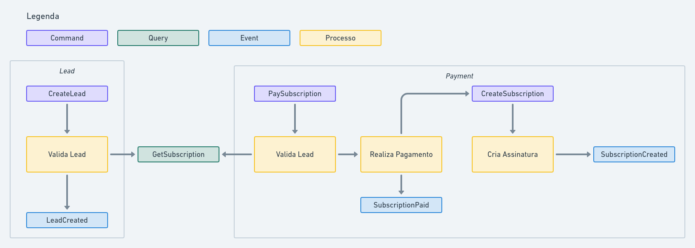

# NestJs - Introdução ao CQS e CQRS

## Definições
CQS: Command Query Separation

CQRS: Command Query Responsibility Segregation

## Exemplo

Contexto: Criação de uma assinatura do WOL

Passos:
- Criar lead:
  - validar se não há assinatura com mesmo email
- Realizar pagamento:
  - validar se não há assinatura com mesmo email
- Cadastrar aluno

